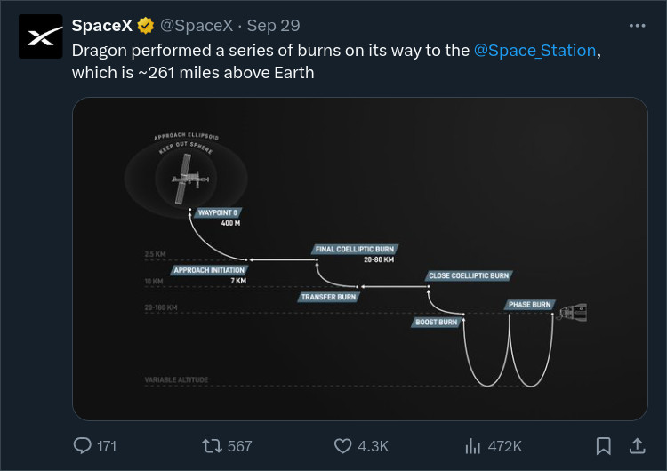

# Surfing X Blind

- No like counts
- No retweet counts
- No reply counts
- No view counts
- No post time
- No following count
- No follower count
- No profile pop-up on hover
- No sidebar trending panels

X post before



X post after


You can toggle these cosmetic filters on and off from uBlock Origin. Usually the uBlock Origin icon is in the browser toolbar, click it, the cosmetic filters are toggled via the eye icon.

## Setup

Navigate to your [uBlock Origin](https://github.com/gorhill/uBlock) *Filter lists*. Scroll down to *Import...* and add the following filter URL, then click Apply changes.

```
https://raw.githubusercontent.com/gerardroche/surfing-x-blind/refs/heads/master/surfing-x-blind.txt
```

Alternatively, manually copy the filters directly into your custom filters (the "My Filters" tab)
